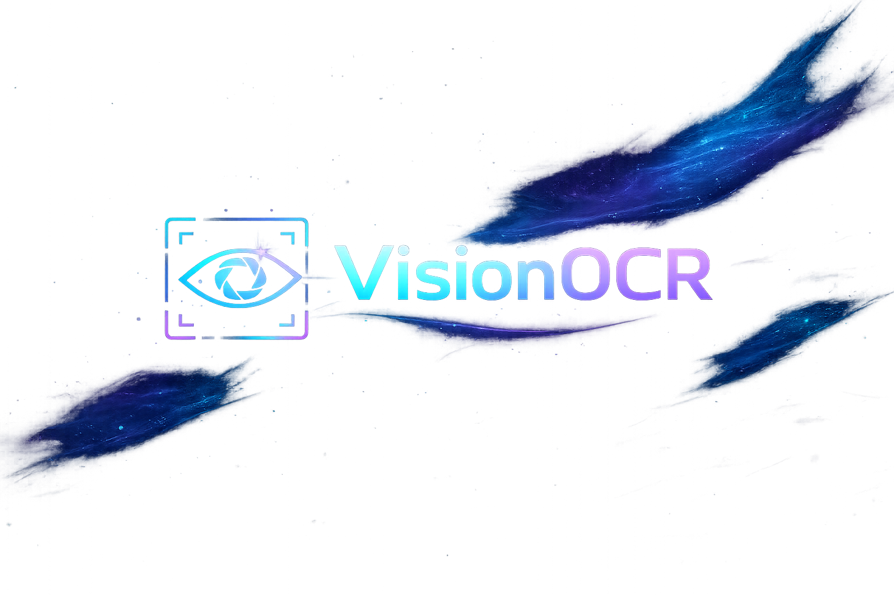
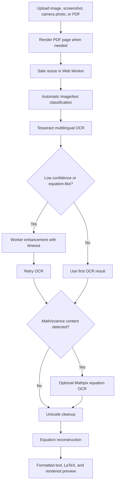

# VisionOCR - VisionText AI


VisionOCR is a production-ready AI OCR website for converting images, screenshots, camera captures, and scanned PDFs into clean editable text. It is designed for difficult OCR cases such as mathematical equations, physics formulas, chemistry notation, programming symbols, multilingual documents, Unicode characters, and emoji-rich text.

Built with React, Vite, Tailwind CSS, Framer Motion, Tesseract.js, Mathpix integration, pdf.js, KaTeX, and a safe browser-side preprocessing worker.

## Live Demo

[Open VisionOCR on Vercel](https://ai-photo-to-text-website-ocr.vercel.app)

## Preview



## Highlights

- Automatic OCR immediately after upload
- No manual OCR mode, scan mode, or engine selector
- Drag and drop image upload
- Paste screenshots directly from the clipboard
- Mobile camera upload support
- Scanned PDF page rendering with pdf.js
- Lightweight image preprocessing in a Web Worker
- Timeout protection to prevent browser freezes
- Automatic retry with enhancement only when OCR confidence is low
- Tesseract.js for multilingual OCR
- Optional Mathpix API route for high-quality equation OCR
- Deterministic equation and Unicode reconstruction layer
- KaTeX rendered equation preview
- Copy extracted text
- Download TXT, TEX, and PDF exports
- Responsive futuristic glassmorphism UI
- GitHub-ready and Vercel-ready production setup

## What It Preserves

VisionOCR focuses on preserving the shape and meaning of technical text:

- Mathematical equations
- Physics formulas
- Chemistry formulas
- Unicode symbols
- Scientific notation
- Greek letters
- Fractions
- Superscripts and subscripts
- Integrals and summations
- Programming operators
- Currency symbols
- Emojis
- Multilingual text
- PDF page structure

## Example Reconstruction

```txt
Input OCR noise:
Jo e de = ઝુ

Final Unicode output:
∫₀∞ e^{-x²} dx = √π/2

LaTeX output:
\int_0^\infty e^{-x^2} dx = \frac{\sqrt{\pi}}{2}
```

## Symbol Coverage

### Math

```txt
∫ ∮ ∑ ∏ ∞ ≈ ≠ ≤ ≥ ± × ÷ √ ∂ ∇ ∈ ∉ ∩ ∪ ⊂ ⊆ ∝ ∴ ∵
```

### Physics

```txt
ħ λ μ Ω α β γ δ θ π σ τ Φ Ψ ω
```

### Chemistry

```txt
H₂O CO₂ H₂SO₄ NaCl ⇌ → ← Δ ° mol
```

### Programming

```txt
{} [] () <> != === && || => <=> <- ->
```

### Currency And Emoji

```txt
₹ $ € £ ¥ 😀 🔥 🎮 🚀 ❤️
```

## OCR Pipeline



## Smart Formatting

The reconstruction layer repairs common OCR mistakes:

```txt
e -x2   -> e^{-x²}
e^-x2   -> e^{-x²}
x2      -> x²
H2O     -> H₂O
CO2     -> CO₂
H2SO4   -> H₂SO₄
sqrt pi -> √π
<->     -> ↔
<=>     -> ⇔
```

## Typography System

VisionOCR uses a specialized fallback stack so OCR output renders technical text clearly:

- UI: Inter
- Math and science: STIX Two Math, Latin Modern Math, Noto Sans Math
- Unicode and symbols: Noto Sans Symbols, Noto Sans Symbols 2, Noto Sans
- Emoji: Noto Emoji, Noto Color Emoji
- Code and LaTeX: JetBrains Mono

CSS rendering is tuned with:

```css
text-rendering: optimizeLegibility;
-webkit-font-smoothing: antialiased;
-moz-osx-font-smoothing: grayscale;
```

## Tech Stack

| Layer | Technology |
| --- | --- |
| Frontend | React, Vite |
| Styling | Tailwind CSS |
| Animation | Framer Motion |
| OCR | Tesseract.js |
| Equation OCR | Mathpix API route |
| PDF Rendering | pdf.js |
| Math Preview | KaTeX |
| Export | TXT, TEX, PDF |
| Deployment | GitHub, Vercel |

## Project Structure

```txt
VisionText-AI/
├── api/
│   ├── mathpix-core.js
│   └── mathpix.js
├── public/
│   ├── ocr-preprocess-worker.js
│   ├── robots.txt
│   └── visionocr-logo.png
├── src/
│   ├── components/
│   ├── lib/
│   ├── pages/
│   ├── App.jsx
│   ├── index.css
│   └── main.jsx
├── package.json
├── tailwind.config.js
└── vite.config.js
```

## Getting Started

### Install

```bash
npm install
```

### Run Locally

```bash
npm run dev
```

### Build

```bash
npm run build
```

### Preview Production Build

```bash
npm run preview
```

## Mathpix Setup

Mathpix is optional, but recommended for high-accuracy equation OCR. Add these variables locally in `.env.local` and in Vercel project environment variables:

```bash
MATHPIX_APP_ID=your_app_id
MATHPIX_APP_KEY=your_app_key
```

The browser calls the server-side route:

```txt
/api/mathpix
```

Your Mathpix credentials are never exposed to the client.

## Deployment

### GitHub

```bash
git init
git add .
git commit -m "Build VisionText AI OCR app"
git branch -M main
git remote add origin https://github.com/1SAMAY/VisionText-AI.git
git push -u origin main
```

### Vercel

Vercel detects this as a Vite project.

| Setting | Value |
| --- | --- |
| Framework Preset | Vite |
| Build Command | `npm run build` |
| Output Directory | `dist` |
| Install Command | `npm install` |

Add Mathpix environment variables in Vercel if equation OCR is needed in production.

## Accuracy Notes

No OCR engine can guarantee perfect output for every blurry, cropped, handwritten, or low-resolution image. VisionOCR improves results by combining:

- Safe preprocessing
- OCR confidence checks
- Tesseract retry logic
- Mathpix equation OCR when configured
- Unicode cleanup
- Equation reconstruction
- Technical typography optimized for symbols and formulas

For best results, upload clear images with good contrast and crop tightly around the text or equation.

## Scripts

```bash
npm run dev      # Start Vite dev server
npm run build    # Build for production
npm run preview  # Preview production build
npm run lint     # Run ESLint
```

## License

MIT License.
